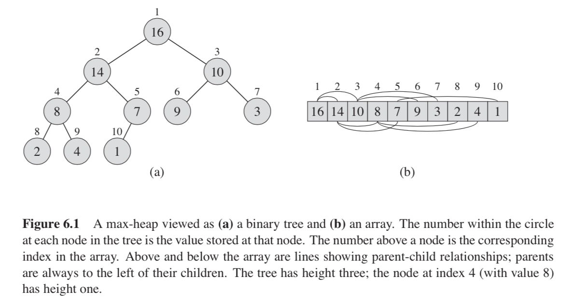
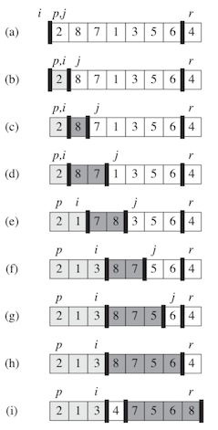
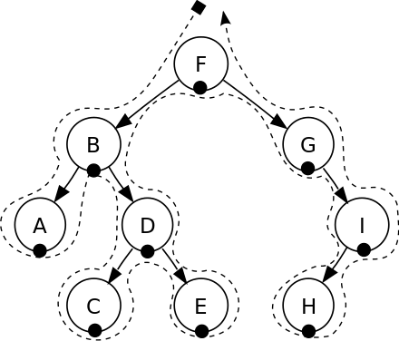
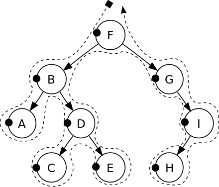
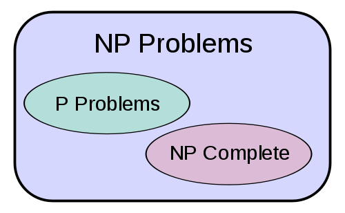

[Huffman Tree](dataStructures/HuffmanTree.md)

[Binary Search Tree](dataStructures/binarySearchTree.md)

[Tree Traversal](treeTraversal.md)

[Algorithms and data structures TDT4120](README.md)

[Algorithms](algorithms.md)

[Terminology](terminology.md)

[Graph](graph/README.md)

[Searching](searching/README.md)


Introduction to Algorithms
==
I Foundations
--
2.1 Insertion sort
--
Insertion sort is like sort a hand of playing cards:
- start with an empty hand
- take one card each time
- compare the card to the cards already in hand from right to left
- then put it in the right place.

| Algorithm         | Worst-case running time   | Average-case / expected running timea |
| ---               | ---                       | ---                                   |
| Insertion sort    | Θ(n^2)                    | Θ(n^2)                                | 

2.3 Designing algorithms
--
**recursive** structure: 
- solve problem by call themselves recursively to deal with closely related subproblems.

**divide-and-conquer** approach:
- recursive structure typically follow a divide-and-conquer approach.
- which break the problem into several subproblems, solve subproblems recursively, then combine solutions to create a solution to the original problem.
    - **Divide** the problem into a number of subproblems that are smaller instances of the same problem.
    - **Conquer** the subproblems by solving them recursively. If the subproblem sizes are small enough, however, just solve the subproblems in a straightforward manner.
    - **Combine** the solutions to the subproblems into the solution for the original problem.

#####Merge sort


- T(n) = Θ(1) if n ⩽ c
    - problem size n, if problem size is small enough say n ⩽ c
- T(n) = aT(n/b) + D(n) +C(n) otherwise
    - a subproblems, each of which is 1/b the size of original.
        - it takes time T(n/b) to solve one subproblem of size n/b
            - so it takes time aT(n/b) to solve a of them.
    - D(n) time to divide the problem into subproblems
    - C(n) time to combine the solutions.

    - total cost :
        - cn(lg n + 1) = cn lg n + cn
            - **recursion tree has lg n+1 levels** each costing cn
        - ignoring low-order term and constant c:
            - **Θ(n lg n)**

 
| Algorithm         | Worst-case running time   | Average-case / expected running timea |
| ---               | ---                       | ---                                   |
| merge sort        | Θ(n lg n)                 | Θ(n lg n)                             |

II Sorting and Order Statistics
--

Insertion sort, merge sort, heapsort, and quicksort are all comparison sorts:
- they determine the sorted order of an input array by comparing elements.
- heapsort & merge sort are asymtotically optimal comparison sorts.

| Algorithm         | Worst-case running time   | Average-case / expected running timea |
| ---               | ---                       | ---                                   |
| Insertion sort    | Θ(n^2)                    | Θ(n^2)                                |
| merge sort        | Θ(n lg n)                 | Θ(n lg n)                             |
| heapsort          | O(n lg n)                 | -                                     |
| quicksort         | Θ(n^2)                    | Θ(n lg n) (expected)                  |
| Counting sort     | Θ(k + n)                  | Θ(k + n)                              | 
| Radix sort        | Θ(d(n + k))               | Θ(d(n + k))                           |
| Bucket sort       | Θ(n^2)                    | Θ(n) (average-case)                   |

6 Heapsort
--

6.1 Heaps
--
The (binary) heap data structure is an aray object that we can view as a nearly complete binary tree.
- the tree is conpletely filled on all levels except possibly the lowest, which is filled from the left up to a point.
- heap property:
    - If A is a parent node of B then the key of node A is ordered with respect to the key of node B with the same ordering applying across the heap. 
    - Either the keys of parent nodes are always greater than or equal to those of the children and the highest key is in the root node (this kind of heap is called **max heap**) 
    - or the keys of parent nodes are less than or equal to those of the children and the lowest key is in the root node (**min heap**).



The max-heap property:
- A[Parent(i)] ⩾ A[i]
    - largest element is at the root.
        - subtree rooted at a node contains values no larger than that contained at the node itself. 

The min-heap property:
- is opposite with max-heap
    - the smallest element in a min-heap is at the root.
- A[Parent(i)] ⩽ A[i]

| Algorithm         | Worst-case running time   | Average-case / expected running timea |
| ---               | ---                       | ---                                   |
| heapsort          | O(n lg n)                 | -                                     |

6.2 Maintaining the heap property
--
```Java
    public static int[] maxHeapify(int[] A, int i) {
        int l = left(i);
        int r = right(i);
        int largest;
        if (l <= A.length - 1 && A[l] > A[i]) {
            largest = l;
        } else {
            largest = i;
        }
        if (r <= A.length - 1 && A[r] > A[i]) {
            largest = r;
        }
        if (largest != i) {
            swap(A, i, largest);
            maxHeapify(A, largest);
        }
        return A;
    }
```

run time:
- subtree size n
- cost Θ(1) to fix up the relationships
- the children's subtrees each have size at most 2n/3
- the worst case occurs when the bottom level of the tree is exactly half full.
- T(n) ⩽ T(2n/3) + Θ(1)
    - T(n) = O(lg n)
        - size 2n/3 has max lg n levels which is runtime

6.3 Building a heap
--
```Java
    public static int[] buildMaxHeap(int[] A) {
        for (int i = A.length; i > 0; i--) {
            maxHeapify(A, i);
        }
        return A;
    }
```

run time:
- build max heap cost O(n) times to call
- maxHeapity, each maxHeapilty run O(lg n) times
    - so building a heap cost **O(n lg n)**

6.4 The heapsort algorithm
--
```Java
    public static int[] heapsort(int[] A) {
        A = buildMaxHeap(A);
        for (int i = A.length; i < 1; i--) {
            swap(A, 1, i);
            maxHeapify(A, 1);
        }
        return A;
    }
```

run time:
- **O(n lg n)**

6.5 Priority queues
--
A **priority queue** 
- is a data structure for maintaining a set S of elements, each with an associated value called key. 
- is an abstract data type which is like a regular queue or stack data structure, but where additionally each element has a "priority" associated with it. In a priority queue, an element with high priority is served before an element with low priority. If two elements have the same priority, they are served according to their order in the queue. <wikipedia>
- While priority queues are often implemented with heaps, they are conceptually distinct from heaps. 
- A priority queue is an abstract concept like "a list" or "a map"; just as a list can be implemented with a linked list or an array, a priority queue can be implemented with a heap or a variety of other methods such as an unordered array. <wikipedia>

- A max-priority queue supports :
    - INSERT (S, x) inserts the element x into the set S, which is equivalent to the operation S = S ⋃ {x}.
    - MAXIMUM(S) returns the element of S with the largest key.
    - EXTRACT-MAX (S) removes and returns the element of S with the largest key.
    - INCREASE-KEY (S, x, k) increases the value of element x’s key to the new value k, which is assumed to be at least as large as x’s current key value.


7 Quicksort
--
| Algorithm         | Worst-case running time   | Average-case / expected running timea |
| ---               | ---                       | ---                                   |
| quicksort         | Θ(n^2)                    | Θ(n lg n) (expected)                  |

quicksort is often the best parctical choice for sorting
- efficient on the average
- is often faster in practice than other O(n log n) algorithms.

```Java
    public static void sort(int[] a, int from, int to) {
        if (from >= to) {
            return;
        }
        int p = partition(a, from, to);
        sort(a, from, p - 1);
        sort(a, p + 1, to);
    }

    public static int partitioning(int[] A, int p, int r) {
        int x = A[r];
        int i = p - 1;
        for (int j = p; j < r; j++) {
            if (A[j] <= x) {
                i++;
                swap(A, i, j);
            }
        }
        swap(A, i + 1, r);
        return i + 1;
    }

// result:
array: 2, 8, 7, 1, 3, 5, 6, 4, 
swap : 2, 8, 7, 1, 3, 5, 6, 4, 
swap : 2, 1, 7, 8, 3, 5, 6, 4, 
swap : 2, 1, 3, 8, 7, 5, 6, 4, 
swap : 2, 1, 3, 4, 7, 5, 6, 8, 
swap : 2, 1, 3, 4, 7, 5, 6, 8, 
swap : 2, 1, 3, 4, 7, 5, 6, 8, 
swap : 2, 1, 3, 4, 7, 5, 6, 8, 
swap : 1, 2, 3, 4, 7, 5, 6, 8, 
a    : 1, 2, 3, 4, 7, 5, 6, 8,   p: 0
a    : 1, 2, 3, 4, 7, 5, 6, 8,   p: 2
swap : 1, 2, 3, 4, 7, 5, 6, 8, 
swap : 1, 2, 3, 4, 7, 5, 6, 8, 
swap : 1, 2, 3, 4, 7, 5, 6, 8, 
swap : 1, 2, 3, 4, 7, 5, 6, 8, 
swap : 1, 2, 3, 4, 5, 7, 6, 8, 
swap : 1, 2, 3, 4, 5, 6, 7, 8, 
a    : 1, 2, 3, 4, 5, 6, 7, 8,   p: 5
a    : 1, 2, 3, 4, 5, 6, 7, 8,   p: 7
a    : 1, 2, 3, 4, 5, 6, 7, 8,   p: 3
       1, 2, 3, 4, 5, 6, 7, 8, 

```



7.4 Analysis of quicksort
--
worst-case partitioning:
```java
    int[] A = {9, 8, 7, 6, 5, 4, 3, 2, 1};
    public static int partitioning(int[] A, int p, int r) {
        int x = A[r];
        ...
```

- run time:
    - partitioning costs Θ(n) time
    - one recursive call (array size 0) cost T (0) = Θ(1)
    - the other recursive call cost T(n-1)
    - T(n) = T(n-1) + T(0) + Θ(n)
        - T(n) = T(n-1) + Θ(n)
            - **T(n) = Θ(n^2)**

best-case partitioning:
- if each of the subproblems size are no more than n/2
- T(n) = 2T(n/2) + Θ(n)
    - **T(n) = Θ(n lg n)**

8 Sorting in Linear Time
--
#####Comparison sorts:
the sorted order they determine is based only on comparisons between the input elements.
- property:
    - an comparison sort must make **Ω(n lg n)** comparisons in the **worst case** to sort n elements


8.2 Counting sort
--
sorting a collection of objects according to keys that are small integers; 
- that is, it is an integer sorting algorithm. 
- It operates by counting the number of objects that have each distinct key value, and using arithmetic on those counts to determine the positions of each key value in the output sequence. 
- Its running time is linear in the number of items and the difference between the maximum and minimum key values, 
    - so it is **only suitable for** direct use in situations where the variation in **keys is not significantly greater than the number of items**.

```java
    /**
     * @param A
     *         input is an array A
     * @param B
     *         hold for the sorted output
     * @param k
     *         k >= the max element in A
     *
     * @return
     */
    public static int[] sort(int[] A, int[] B, int k) {
        int[] C = new int[k];
        for (int j = 0; j < A.length; j++) {
            C[A[j]] += 1;
        }
        for (int i = 1; i < k; i++) {
            C[i] = C[i] + C[i - 1];
        }
        for (int j = A.length - 1; j >= 0; j--) {
            B[C[A[j]] - 1] = A[j];
            C[A[j]] -= 1;
        }
        return B;
    }

--
input A:   2   5   3   0   2   3   0   3
holderB:   0   0   0   0   0   0   0   0
C      :   0   0   0   0   0   0
C1     :   2   0   2   3   0   1
C2     :   2   2   4   7   7   8
B-1    :   0   0   0   0   0   0   3   0
C-3    :   2   2   4   6   7   8
B-2    :   0   0   0   0   0   0   3   0
C-4    :   1   2   4   6   7   8
B-3    :   0   0   0   0   0   3   3   0
C-5    :   1   2   4   5   7   8
B-4    :   0   0   0   2   0   3   3   0
C-6    :   1   2   3   5   7   8
B-5    :   0   0   0   2   0   3   3   0
C-7    :   0   2   3   5   7   8
B-6    :   0   0   0   2   3   3   3   0
C-8    :   0   2   3   4   7   8
B-7    :   0   0   0   2   3   3   3   5
C-9    :   0   2   3   4   7   7
B-8    :   0   0   2   2   3   3   3   5
C-10   :   0   2   2   4   7   7
           0   0   2   2   3   3   3   5
```


8.3 Radix sort
--
- radix sort is a non-comparative integer sorting algorithm that sorts data with integer keys by grouping keys by the individual digits which share the same significant position and value. 
- A positional notation is required, but because integers can represent strings of characters (e.g., names or dates) and specially formatted floating point numbers, radix sort is not limited to integers.
- Θ(d(n + k)) time if the stable sort uses Θ(n + k)


8.4 Bucket sort
--
Bucket sort, or bin sort, is a sorting algorithm that works by partitioning an array into a number of buckets. 
- Each bucket is then sorted individually, either using a different sorting algorithm, or by recursively applying the bucket sorting algorithm. 
- It is a distribution sort, and is a cousin of radix sort in the most to least significant digit flavour. 
- Bucket sort is a generalization of pigeonhole sort. 
- Bucket sort can be implemented with comparisons and therefore can also be considered a comparison sort algorithm.
    - worest-case: **Θ(n^2)**  
    - **Θ(n)** (average-case)

Bucket sort works as follows:
- Set up an array of initially empty "buckets".
- Scatter: Go over the original array, putting each object in its bucket.
- Sort each non-empty bucket.
- Gather: Visit the buckets in order and put all elements back into the original array.


9 Medians and Order Statistics
--
n - 1 comparisons are necessary to determine the minimum of n elements.

find both minimum and maximum is at most 3⎿ n/2 ⏌ 
- compare pairs of elements from the input first with each other, then compare the smaller with current minimum and larger with current maximum.

III Data Structures
--
Dictionary:
- supports:
    - insert elements
    - delete elements

10 Elementary Data Structures
--
10.1 Stacks and queues
--
#####stacks
- last-in, first-out
- Insert operation on a stack is often called **push**
- Delete operation, does not take an elemet argument, often called **Pop**
    - operation push & pop each cost O(1) time

#####queues
- first-in, last-out
- Insert operation on a queue is often called **Enqueue**
- Delete is called **Dequeue**
- the queue has a **head** and **tail** 
    - when an element is enqueued, it takes place at the tail.


10.2 Linked lists
--
En lenket liste er en enkel lineær datastruktur som representerer elementer i sekvens. Hvert element peker til det neste i rekkefølgen.
```python
class Node:
    def __init__(self):
        self.value = None
        self.next  = None
n1 = Node()
n2 = Node()
n3 = Node()
n1.value = 1
n2.value = 2
n3.value = 3
n1.next  = n2
n2.next  = n3
print ("Linked List:\nn1:"+str(n1.value)+"\nn2:"+str(n1.next.value)+"\nn3:"+str(n1.next.next.value))

Linked List:
n1:1
n2:2
n3:3
```

search procedure takes Θ(n) time in the worst case (search entire list).

11 Hash Tables
--

function|   Average     |    Worst case
---     |---            |---
Search  |O(1)           | O(n)
Insert  |O(1)           | O(n)
Delete  |O(1)           | O(n)

11.2 Hash Tables
--
a hash table (hash map) is a data structure used to implement an associative array, a structure that can map keys to values. A hash table uses a hash function to compute an index into an array of buckets or slots, from which the correct value can be found.

11.3 Hash functions
--
A good hash function and implementation algorithm are essential for good hash table performance, but may be difficult to achieve.

A basic requirement is that the function should provide a uniform distribution of hash values. A non-uniform distribution increases the number of collisions and the cost of resolving them. Uniformity is sometimes difficult to ensure by design, but may be evaluated empirically using statistical tests

12 Binary Search Trees
--
The search tree data structure supports many dynamic-set operations, including: 
- SEARCH, 
- MINIMUM, 
- MAXIMUM, 
- PREDECESSOR, 
- SUCCESSOR, 
- INSERT, and 
- DELETE. 

Thus, we can use a search tree both as a dictionary and as a priority queue


12.1 What is a binary search tree?
--
a binary search tree (BST), sometimes also called an ordered or sorted binary tree, is a node-based binary tree data structure where each node has a comparable key (and an associated value)
Binary search tree property:
- Let x be a node in a binary search tree. 
- If y is a node in the left subtree of x, then y.key >= x.key. 
- If y is a node in the right subtree of x, then y.key <= x.key.
- sorted by **inorder tree walk**


inorder tree walk
- subtree -> root -> subtree



preorder tree walk
- root -> right subtree -> left subtree



postorder tree walk
- right subtree -> left subtree -> root


12.2 Querying a binry search tree
--
```java
    public Node treeSearch(Node x, Object k) {
        if (x == null || k == x.data) {
            return x;
        }
        if (x.data.compareTo(k) > 0) {
            return treeSearch(x.left, k);
        } else {
            return treeSearch(x.right, k);
        }
    }
```

binary search tree height h >= ⎿ lg n ⏌

function|   Average     |    Worst case
---     |---            |---
Search  |O(lg n)        | O(n)
Insert  |O(lg n)        | O(n)
Delete  |O(lg n)        | O(n)

[Binary Search Tree](dataStructures/binarySearchTree.md)

IV Advanced Design and Analysis Techniques
--

15 Dynamic Programming
--
In mathematics, computer science, economics, and bioinformatics, **dynamic programming** :
- is a method for solving a complex problems by breaking it down into a collection of simpler subproblems. 
- It is applicable to problems exhibiting the properties of overlapping subproblems and optimal substructure. 
- When applicable, the method takes far less time than naive methods that don't take advantage of the subproblem overlap (like depth-first search).
- In order to solve a given problem, using a dynamic programming approach, we need to solve different parts of the problem (subproblems), then combine the solutions of the subproblems to reach an overall solution.

There are two key attributes that a problem must have in order for dynamic programming to be applicable: 
- optimal substructure and overlapping subproblems. 
- If a problem can be solved by combining optimal solutions to non-overlapping subproblems, the strategy is called "divide and conquer" instead. 
- This is why mergesort and quicksort are not classified as dynamic programming problems.

When developing a dynamic-programming algorithm, we follow a sequence of four steps:
- Characterize the structure of an optimal solution.
- Recursively define the value of an optimal solution.
- Compute the value of an optimal solution, typically in a bottom-up fashion. 
- Construct an optimal solution from computed information.

16 Greedy Algorithms
--
Always makes the choice that looks best at the moment.
- find optimal choice locally 
    - hope it will lead to a globally optimal solution.

In general, greedy algorithms have five components:
- A candidate set, from which a solution is created
- A selection function, which chooses the best candidate to be added to the solution
- A feasibility function, that is used to determine if a candidate can be used to contribute to a solution
- An objective function, which assigns a value to a solution, or a partial solution, and
- A solution function, which will indicate when we have discovered a complete solution

16.3 Huffman codes
--
Huffman codes compress data very effectively: savings of 20% to 90% are typical, depending on the characteristics of the data being compressed. We consider the data to be a sequence of characters. Huffman’s greedy algorithm uses a table giving how often each character occurs (i.e., its frequency) to build up an optimal way of representing each character as a binary string.

```java
    /**
     * Constructs a Huffman tree from given character frequencies.
     * 
     * @param frequencies
     *            a map whose keys are the characters to be encoded
     *            and whose values are the frequencies of the characters
     */
    public HuffmanTree(Map<Character, Integer> frequencies) {
        PriorityQueue<Node> nodes = new PriorityQueue<Node>();
        for (char ch : frequencies.keySet()) {
            Node newNode = new Node();
            newNode.character = ch;
            newNode.frequency = frequencies.get(ch);
            nodes.add(newNode);
        }
        while (nodes.size() > 1) {//reduce queue to node set last node to root
            Node smallest = nodes.remove();//remove the head of this queue
            Node nextSmallest = nodes.remove();
            Node newNode = new Node();
            newNode.frequency = smallest.frequency + nextSmallest.frequency;
            newNode.left = smallest;
            newNode.right = nextSmallest;
            nodes.add(newNode);
        }
        root = nodes.remove();
    }
```


[Huffman Tree](dataStructures/HuffmanTree.md)

VI Graph Algorithms
--

graph G = (V, E)
- vertices V
- edges    E

22 Elementary Graph Algorithms
--
Two standard ways to represent graph G = (V, E)
1. adjacency lists
2. adjacency matrix

    - both applies:
        - directed and undirected graphs

Weighted graph:
- each edge has an associated weight
    - typically given by a weight function 


22.2 Breadth-first search
--
Prim’s minimum-spanning- tree algorithm and Dijkstra’s single-source shortest-paths algorithm use ideas similar to those in breadth-first search.

Given a graph G = (V, E) and a distinguished source vertex s, breadth-first search systematically explores the edges of G to “discover” every vertex that is reachable from s.

total time spent in scanning adjacency lists is O(E).
- worst case searching O(E)
- The overhead for initialization is O(V), 
- and thus the total running time of the BFS procedure is **O(V + E)**.


22.3 Depth-first search
--
[BFS & DFS](searching/README.md)

DFS running time : **Θ(V + E)**

22.4 Topological sort
--
dag: directed acyclic graph.

**topological sort** (sometimes abbreviated topsort or toposort) or topological ordering of a directed graph :
- is a linear ordering of its vertices such that for every directed edge uv from vertex u to vertex v, u comes before v in the ordering. 
    - For instance, the vertices of the graph may represent tasks to be performed, and the edges may represent constraints that one task must be performed before another; 
        - in this application, a topological ordering is just a valid sequence for the tasks. 
- A topological ordering is possible if and only if the graph has no directed cycles, that is, if it is a directed acyclic graph (DAG). Any DAG has at least one topological ordering, 
    - and algorithms are known for constructing a topological ordering of any DAG in linear time.
- can use depth-first search to perform a topological sort
    - runtime: same with DFS: **Θ(V + E)**


valid topological sorts for the DAG graph:
- 7, 5, 3, 11, 8, 2, 9, 10 (visual left-to-right, top-to-bottom)
- 3, 5, 7, 8, 11, 2, 9, 10 (smallest-numbered available vertex first)
- 5, 7, 3, 8, 11, 10, 9, 2 (fewest edges first)
- 7, 5, 11, 3, 10, 8, 9, 2 (largest-numbered available vertex first)
- 7, 5, 11, 2, 3, 8, 9, 10 (attempting top-to-bottom, left-to-right)
- 3, 7, 8, 5, 11, 10, 2, 9 (arbitrary)

23 Minimum Spanning Trees
--
Given a connected, undirected graph, **a spanning tree** of that graph is a subgraph that is a tree and connects all the vertices together. 
- A single graph can have many different spanning trees. 
- We can also assign a weight to each edge, which is a number representing how unfavorable it is, and use this to assign a weight to a spanning tree by computing the sum of the weights of the edges in that spanning tree. 
- **A minimum spanning tree** (MST) or minimum weight spanning tree is then a spanning tree with weight less than or equal to the weight of every other spanning tree. 
    - More generally, any undirected graph (not necessarily connected) has a minimum spanning forest, which is a union of minimum spanning trees for its connected components.

```
Generic-MST(G, w):
    A = None
    while (A does not form a spanning tree):
        find an edge (u, v) that is safe for A
        A = A U {(u, v)}
    return A
```
- find an edge (u, v) that is safe for A:
    - any cut of G (u1, v1) respets to A
    - find light edge (u, v) 
- add (u, v) to A
- repeat until A form a spanning tree

23.2 The algorithms of Kruskal and Prim
--
#####Kruskal's algorithm
- the set A is a forest whose vertices are all those of the given graph.
- the safe edge added to A is always a least-weight edge in the graph that connects two distinct components.
- finds a safe edge to add to the growing forest by finding, of all the edges that connect any two trees in the forest of least weight(greedy algorithm).
- running time: **O(E lg V)**

#####Prim's algorithm
- the set A forms a single tree.
- the safe edge added to A is always a least-weight edge connecting the tree to a vertex not in the tree.
- the tree start from an arbitrary root vertex r and grows until the tree spans all the vertices in V.
    - each step adds to the tree A a light edge(greedy strategy) that connects A to an isolated vertex
        - -- one on which no edge of A is incident.
- run time: **O(E lg V)**


24 Single-Source Shortest Paths
--
lemma 24.1 **subpaths of shortest paths are shortest paths**

- greedy algorithm: **Dijkstra**
- dynamic-programming: **Floyd-Warshall algorithm**

Negative edge:
- Dijkstra's algorithm assume all edge weights are nonnegative
- Bellman-Ford algorithm allow negative-weight edges.

Cycles:
- shortest path can not contain cycle!

```
relax(u, v, w):
    if v.d > u.d + w(u, v)
        v.d = u.d + w(u, v)
        v.pi = u
```
relaxing an edge(u, v)
- testing whether we can improve the shortest 
    - updating v.d and v.pi

24.1 The Bellman-Ford algorithm
--

The Bellman-Ford algorithm solves the single-source shortest-paths problem in the general case in which edge weights may be negative.
- The algorithm relaxes edges, progressively decreasing an estimate v.d on the weight of a shortest path from the source s to each vertex v ∈ V until it achieves the actual shortest-path weight 𝜹(s.v) 
- The algorithm returns TRUE if and only if the graph contains no negative-weight cycles that are reachable from the source.

```
BELLMAN-FORD(G, w, s):
    INITIALIZE-SINGLE-SOURCE (G, s)
    for i = 1 to G.V - 1
        for each edge (u, v) ∈ G.E
        RELAX(u, v, w)
    for each edge (u, v) ∈ G.E
        if v.d > u.d + w(u, v)
            return False
    return True
```

run time : **O(VE)**


24.3 Dijkstra's algorithm
--

Dijkstra’s algorithm solves the single-source shortest-paths problem on a weighted, directed graph G = (V, E) for the case in which all edge weights are nonnegative.
- Dijkstra’s algorithm maintains a set S of vertices whose final shortest-path weights from the source s have already been determined. 
- The algorithm repeatedly selects the vertex u ∈ V - S with the minimum shortest-path estimate, adds u to S, and relaxes all edges leaving u. 


```java
    /**
     * Dijkstra's algorithm
     * <p/>
     * solves the single-source shortest path problem for a graph with non-negative edge path costs,
     * producing a shortest path tree. This algorithm is often used in routing and as a subroutine
     * in other graph algorithms.
     * <p/>
     * Worst case run time: O ( E + V * log V )
     *
     * @param G
     *         {@link graph.G}
     */
    public static Set<Node> Dijkstra(G G) {
        int s = 1;
        initializeSingleSource(G, s);
        Set<Node> S = new HashSet<Node>();
        PriorityQueue<Node> Q = new PriorityQueue<Node>();
        for (Node node : G.getV()) {
            Q.add(node);
        }
        while (Q.size() != 0) {               // run time V
            Node u = Q.poll();                // return the smallest u.weight
            S.add(u);                         // worst case log V (for (Node v : G.getAdjacency(u)))
            for (Node v : G.getAdjacency(u)) {// run time (getAdjacency = E) E + V * log V
                int w = G.getWeight(u.getValue(), v.getValue());
                relax(u, v, w);
            }
        }
        return S;
    }
```

25 All-Pairs Shortest Paths
--

We can solve an all-pairs shortest-paths problem by running a single-source shortest-paths algorithm |V|  times, once for each vertex as the source. 
- If all edge weights are nonnegative, we can use Dijkstra’s algorithm. 
- If we use the linear-array implementation of the min-priority queue, the running time is O(V^3 + VE) = O(V^3) 
- The binary min-heap implementation of the min-priority queue yields a running time of O(VE lg V ), which is an improvement if the graph is sparse. 
- Alternatively, we can implement the min-priority queue with a Fibonacci heap, yielding a running time of O(V^2 lg V + VE).
- If graph has negative-weight edges, we can use Bellman-Ford:
    - running time is O(V^2 E)


25.2 The Floyd-Warshall algorithm
--


26 Maximum Flow
--

26.2 The Ford-Fulkerson method
--


VII Selected Topics
--

34 NP-Completeness
--

In computational complexity theory, a decision problem is NP-complete when it is both in NP and NP-hard. The set of NP-complete problems is often denoted by NP-C or NPC. The abbreviation NP refers to "nondeterministic polynomial time".



