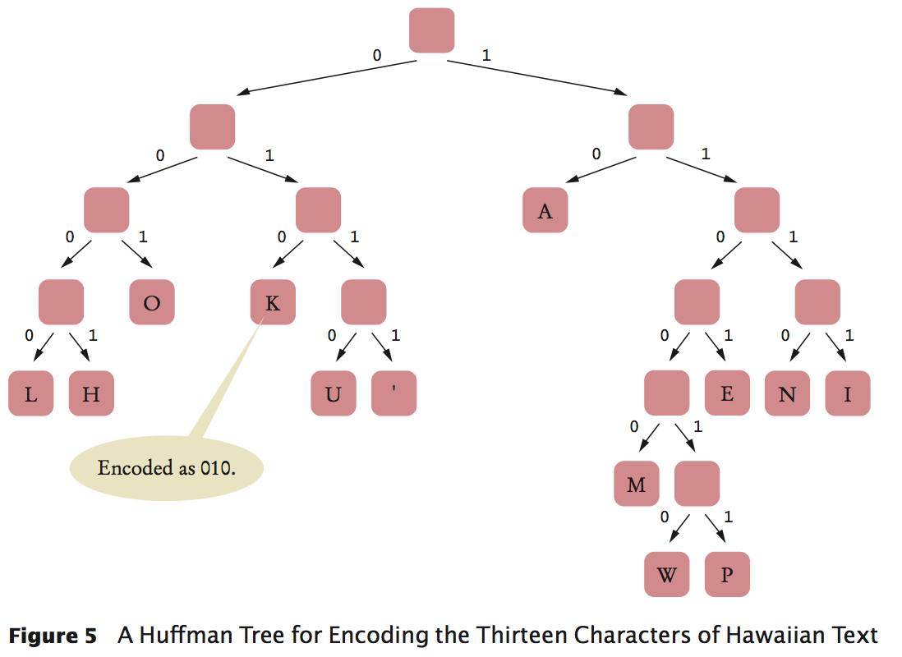

HuffmanTree
==

In a Huffman tree, the leaves contain symbols that we want to encode. To encode a particular symbol, walk along the path from the root to the leaf containing the symbol, and produce a zero for every left turn and a one for every right turn.



code:

```Java
...
while (nodes.size() > 1) {
            Node smallest = nodes.remove();
            Node nextSmallest = nodes.remove();
            Node newNode = new Node();
            newNode.frequency = smallest.frequency + nextSmallest.frequency;
            newNode.left = smallest;
            newNode.right = nextSmallest;
            nodes.add(newNode);
        }
        root = nodes.remove();
    ...
```

[WikiPedia: Huffman coding](https://en.wikipedia.org/wiki/Huffman_coding)

[Data structures](README.md)

[Algorithms and data structures TDT4120](../README.md)


