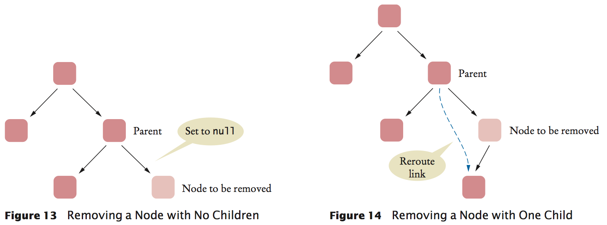
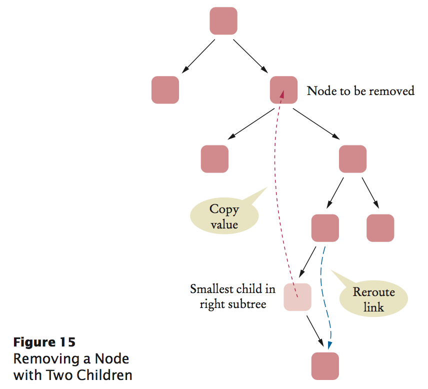

Binary Search Tree
==

[Data structures](README.md)

[Algorithms and data structures TDT4120](../README.md)


Binary Search Tree: remove
--

```Java
/**
 * 
 * @param object
 * @return result message
 */
public String remove(Object object) {
    // find node   to be removed
    Node toBeRemoved = root;
    Node parent = null;
    boolean found = false;
    while (!found && toBeRemoved != null) {
        int compare = toBeRemoved.data.compareTo(object);
        if (compare == 0) {
            found = true;
        } else {
            parent = toBeRemoved;
            if (compare > 0) {
                toBeRemoved = toBeRemoved.left;
            } else {
                toBeRemoved = toBeRemoved.right;
            }
        }
    }
    if (!found) {
        return object + "not found!";
    }
```


```Java
    // to be removed contains object
    // . . if one of the children is empty, use the other
    if (toBeRemoved.left == null || toBeRemoved.right == null) {
        // set newChild
        Node newChild;
        if (toBeRemoved.left == null) {
            newChild = toBeRemoved.right;
        } else {
            newChild = toBeRemoved.left;
        }
        // connect to newChild
        if (parent == null) {// found in root
            root = newChild;
        } else if (parent.left == toBeRemoved) {
            parent.left = newChild;
        } else {
            parent.right = newChild;
        }
        ss = "";
        return object + " removed!" + "\n" + "moved tree: " + "\n"
                + toString(newChild);
    }
```

the node to be removed has two children: Rather than removing the node, it is easier to replace its data value with the next larger value in the tree. That replacement preserves the binary search tree property.

To locate the next larger value, go to the right subtree and find its smallest data value. Keep following the left child links. Once you reach a node that has no left child, you have found the node containing the smallest data value of the subtree. Now remove that node—it is easily removed because it has at most one child to the right. Then store its data value in the original node that was slated for removal.



```Java
    // Neither subtree is empty
    // ... Find smallest element of the right subtree
    Node smallestParent = toBeRemoved;
    Node smallest = toBeRemoved.right;
    System.out.println("..sp: " + smallestParent + " s: " + smallest);
    while (smallest.left != null) {
        smallestParent = smallest;
        smallest = smallest.left;
        System.out.println("....sp: " + smallestParent + " s: " + smallest);
    }

    // smallest contains smallest child in right subtree
    // Move contents, unlink child
    toBeRemoved.data = smallest.data;
    if (smallestParent == toBeRemoved) {
        smallestParent.right = smallest.right;
        System.out
                .println("....=sp: " + smallestParent + " s: " + smallest);
    } else {
        smallestParent.left = smallest.right;
        System.out.println("....!=sp: " + smallestParent + " s: "
                + smallest);
    }
    ss = "";
    return object + " removed!" + "\n" + "moved tree: " + "\n"
            + toString(toBeRemoved.left);
}

```
