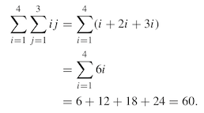
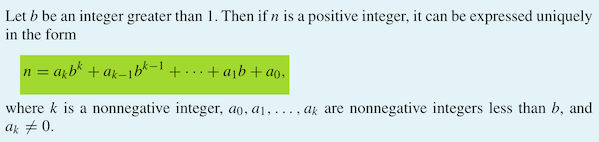
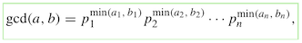
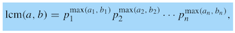
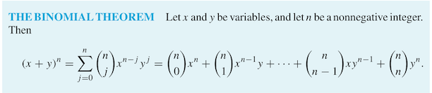

Terminology
==

Discrete Mathematics and Its Application
==
- Discrete mathematics provides the mathematical foundations for many computer science courses including data structures, algorithms, database theory, automata theory, formal languages, compiler theory, computer security, and operating systems.

1       The Foundations: Logic and Proofs
--
Logic is the basis of all mathematical reasoning, and of all automated reasoning. 
- It has practical applications to the design of computing machines, to the specification of systems, to artificial intelligence, to computer programming, to programming languages, and to other areas of computer science...

To understand mathematics, we must understand what makes up a correct mathematical argument, 
- that is, **a proof**. 
    - Once we prove a mathematical statement is true, we call it **a theorem**. 
        - A collection of theorems on a topic organize what we know about this topic.
    - proofs are used to: 
        - verify that computer programs produce the correct output for all possible input values, 
        - to show that algorithms always produce the correct result, 
        - to establish the security of a system, 
        - and to create artificial intelligence. 
        - Furthermore, 
            - automated reasoning systems have been created to allow computers to construct their own proofs.

1.1     Propositional Logic
--
The rules of logic give precise meaning to mathematical statements. 
- These rules are used to distinguish between valid and invalid mathematical arguments

A **proposition** is a declarative sentence 
- (that is, a sentence that declares a fact) 
    - that is either true or false, but not both.

    
        Conjunction: Let p and q be propositions. The conjunction of p and q, denoted by p ∧ q, is the proposition “p and q.” The conjunction p ∧ q is true when both p and q are true and is false otherwise.


        The **disjunction** of p and q, denoted by p ∨ q, is the proposition “p or q.” The disjunction p ∨ q is false when both p and q are false and is true otherwise.


        The exclusive or of p and q, denoted by p ⊕ q, is the proposition that is true when exactly one of p and q is true and is false otherwise.


        The conditional statement p → q is the proposition “if p, then q.” The conditional statement p → q is false when p is true and q is false, and true otherwise.  p is called the hypothesis (or antecedent or premise) and q is called the conclusion (or consequence)


        The biconditional statement p ↔ q is the proposition “p if and only if q.” The biconditional statement p ↔ q is true when p and q have the same truth values(both true or both false), and is false otherwise. Biconditional statements are also called bi-implications.


1.2     Applications of Propositional Logic
--

1.3     Propositional Equivalences
--
- A compound proposition that is always true, no matter what the truth values of the propositional variables that occur in it, is called a **tautology**. 
- A compound proposition that is always false is called a **contradiction**. 
- A compound proposition that is neither a tautology nor a contradiction is called a **contingency**.


- The compound propositions p and q are called logically equivalent if p ↔ q is a tautology. 
- The notation p ≡ q denotes that p and q are logically equivalent.
    - he symbol ≡ is not a logical connective, and p ≡ q is not a compound proposition but rather is the statement that p ↔ q is a tautology. The symbol ⇔ is sometimes used instead of ≡ to denote logical equivalence.

        De Morgan laws:
        ¬(p ∧ q) ≡ ¬p ∨ ¬q 
        ¬(p ∨ q) ≡ ¬p ∧ ¬q

1.4     predicates and Quantifiers
--
The notation ∀xP(x) denotes the universal quantification of P(x). Here ∀ is called the universal quantifier. We read ∀xP (x) as “for all xP (x)” or “for every xP (x).” An element for which P (x) is false is called a counterexample of ∀xP (x).
- ∀xP(x) 
    - P (x) is true for every x.
- ∃xP(x)
    - There is an x for which P (x) is true.
    - ∃ is called the existential quantifier.

1.5     Nested Quantifiers
--
∀x∃y(x + y = 0)
- is the same thing as ∀xQ(x), where Q(x) is ∃yP (x, y), where P (x, y) is x + y = 0.


1.6     Rules of Inference
--
Proofs in mathematics are valid arguments that establish the truth of mathematical statements.
- An argument in propositional logic is a sequence of propositions. 
    - All but the final proposition in the argument are called **premises** and the final proposition is called the **conclusion**. 
    - An argument is **valid** if the truth of all its premises implies that the conclusion is true.
- An argument form in propositional logic is a sequence of compound propositions involving propositional variables. 
    - An argument form is valid no matter which particular propositions are substituted for the propositional variables in its premises, the conclusion is true if the premises are all true.

1.7     Introduction to Proofs
--
A proof is a valid argument that establishes the truth of a mathematical statement.

Formally, a theorem is a statement that can be shown to be true. 
- In mathematical writing, the term theorem is usually reserved for a statement that is considered at least somewhat important. 
- Less important theorems sometimes are called propositions.

The integer n is even if there exists an integer k such that n = 2k, and n is odd if there exists an integer k such that n = 2k + 1. 
- (Note that every integer is either even or odd, and no integer is both even and odd.) 
- Two integers have the same parity when both are even or both are odd; 
    - they have opposite parity when one is even and the other is odd.

2       Basic Structures: Sets, Functions, Sequences, Sums, and Matrices
--

2.1     Sets
--
A set is an unordered collection of objects, called elements or members of the set. 
- A set is said to contain its elements. 
    - We write a ∈ A to denote that a is an element of the set A. 
    - The notation a !∈ A denotes that a is not an element of the set A.
- **empty set**, or null set, and is denoted by ∅. 
    - The empty set can also be denoted by { }


- N = {0,1,2,3,...}, the set of natural numbers
- Z = {...,−2,−1,0,1,2,...}, the set of integers
- Z+ = {1, 2, 3, . . .}, the set of positive integers
- Q = {p/q | p ∈ Z, q ∈ Z, and q != 0}, the set of rational numbers R, the set of real numbers
- R+, the set of positive real numbers
- C, the set of complex numbers.


**the power set** of S is the set of all subsets of the set S. The power set of S is denoted by P(S).
- P ({0, 1, 2}) = {∅, {0}, {1}, {2}, {0, 1}, {0, 2}, {1, 2}, {0, 1, 2}}.

2.2     Set Operations
--
Let A and B be sets. 
- The union of the sets A and B, denoted by A ∪ B, 
    - is the set that contains those elements that are either in A or in B, or in both.
    - A ∪ B = {x | x ∈ A ∨ x ∈ B}.

Let U be the universal set. 
- The complement of the set A, is the complement of A with respect to U . Therefore, the complement of the set A is U − A.

2.3     Functions
--
> Let A and B be nonempty sets. 
> A function f from A to B is an assignment of exactly one element of B to each element of A. 
> - We write f(a) = b if b is the unique element of B assigned by the function f to the element a of A. 
> - If f is a function from A to B, we write f : A → B.

Functions are sometimes also called mappings or transformations.

> If f is a function from A to B, we say that A is the domain of f and B is the codomain of f. 
> If f (a) = b, we say that b is the image of a and a is a preimage of b. 
> The range, or image, off is the set of all images of elements of A. Also, if f is a function from A to B, we say that f maps A to B.

#####One to One
-  functions never assign the same value to two different domain elements.

> A function f is said to be **one-to-one**, or an **injunction**, if and only if f (a) = f (b) implies that a = b for all a and b in the domain of f. 
> A function is said to be **injective** if it is one-to-one.
> - express that f is one-to-one using quantifiers as 
>   - ∀a∀b(f (a) = f (b) → a = b) or equivalently 
>   - ∀a∀b(a != b → f (a) != f (b)), 
> - where the universe of discourse is the domain of the function.

#####onto
- the range and the codomain are equal. That is, every member of the codomain is the image of some element of the domain. 

> A function f from A to B is called **onto**, or a **surjection**, 
> - if and only if for every element b∈ B there is an element a ∈ A with f(a)=b. 
> - A function f is called **surjective** if it is onto.
>
> - A function f is onto if ∀y∃x(f (x) = y), 
>   - where the domain for x is the domain of the function and the domain for y is the codomain of the function.

#####one to one correspondence
- The function f is a **one-to-one correspondence**, or a **bijection**, if it is both one-to-one and onto. 
- We also say that such a function is **bijective**.

#####the floor function
Floor function
- Let x be a real number. The floor function rounds x down to the closest integer less than or equal to x.
> The floor function assigns to the real number x the largest integer that is less than or equal to x. The value of the floor function at x is denoted by ⌊x⌋

the ceiling function 
- rounds x up to the closest integer greater than or equal to x.
> The ceiling function assigns to the real number x the smallest integer that is greater than or equal to x. The value of the ceiling function at x is denoted by ⌈x⌉.

2.4     Sequences and Summations
--
Sequences are ordered lists of elements.

> A sequence is a function from a subset of the set of integers (usually either the set {0, 1, 2, . . .} or the set{1,2,3,...})to a set S. We use the notation an to denote the image of the integer n. We call an a term of the sequence.

Double summations arise in many contexts (as in the analysis of nested loops in computer programs).
- first expand the inner summation and then continue by computing the outer summation


2.5     Cardinality of Sets
--
We say that a function is computable if there is a computer program in some programming language that finds the values of this function. If a function is not computable we say it is uncomputable.

2.6     Matrices
--
3       Algorithms
--
brute-force algorithms: 
- find solutions using a straightforward approach without introducing any cleverness.

greedy algorithms 
- a class of algorithms used to solve optimization problems

3.1 Algorithms
--
**An algorithm** is a finite sequence of precise instructions for performing a computation or for solving a problem.

#####Properties of algorithms
- Input. An algorithm has input values from a specified set.
- Output. From each set of input values an algorithm produces output values from a spec-
ified set. The output values are the solution to the problem.
- Definiteness. The steps of an algorithm must be defined precisely.
- Correctness.Analgorithmshouldproducethecorrectoutputvaluesforeachsetofinput
values.
- Finiteness. An algorithm should produce the desired output after a finite (but perhaps
large) number of steps for any input in the set.
- Effectiveness. It must be possible to perform each step of an algorithm exactly and in a
finite amount of time.
- Generality. The procedure should be applicable for all problems of the desired form, not
just for a particular set of input values.

#####Searching Algorithms
**linear search** or **sequential search**
- search one after another until the solution is found, or return 0

**binary search algorithm**
- split list to two sublists, solution is in one of the sublist, repeat the process until the solution is find.

#####Sorting
**bubble sort**
- one of the simplest sorting algorithms, not one of the most efficient.
- successively comparing adjacent elements, interchanging them if they are in the wrong order.

**insertion sort**
- simple but not efficient.
- begin with the second element, compares with other elements set to the place where the element does not exceed the next element, and then start with third element, repeat until the last element.

#####Greedy Algorithms
Algorithms that make what seems to be the “best” choice at each step are called greedy algorithms.

3.2 The Growth of Functions
--
#####Big-O Notation
- estimate the growth of a function without worrying about constant multipliers or smaller order terms.
    - Let f and g be functions from the set of integers or the set of real numbers to the set of real numbers. We say that f (x) is O(g(x)) if there are constants C and k such that
        - **|f (x)| ≤ C |g(x)|**
    - whenever x > k. [This is read as “f (x) is big-oh of g(x).”]

    - n!=1·2·3· ··· ·n

    - logn! ≤ logn^n = nlogn

Big-O notation is used extensively to describe the growth of functions, but it has limitations. 
- In particular, when f (x) is O(g(x)), we have an upper bound, in terms of g(x), for the size of f (x) for large values of x. 
- However, big-O notation does not provide a lower bound for the size of f (x) for large x. For this, we use 
- big-Omega notation big-Ω. When we want to give both an upper and a lower bound on the size of a function f (x), relative to a reference function g(x), we use 
- big-Θ Theta notation.

> logn! ≤ lognn = nlogn.
> - log n! is O(n log n) 
>   - taking C = 1 and k = 1 as witnesses.
> - logbn=log n / log b < n / log b

Let f and g be functions from the set of integers or the set of real numbers to the set of real numbers. 
- We say that f (x) is Θ(g(x)) if f (x) is O(g(x)) and f (x) is Ω(g(x)). 
- When f (x) is Θ(g(x)) we say that f is big-Theta of g(x), that f (x) is of order g(x), and that
 f (x) and g(x) are of the same order.

    - When f (x) is Θ(g(x)), it is also the case that g(x) is Θ(f (x)).
    - f (x) is Θ(g(x)) if and only if:
        - C1|g(x)| ≤ |f (x)| ≤ C2|g(x)|


3.3     Complexity of Algorithms
--
> Worst-case analysis tells us how many operations an algorithm requires to guarantee that it will produce a solution.

Complexity          | Terminology
---                 |---
Θ(1)                | constant      complexity
Θ(log n)            | logarithmic   complexity
Θ(n)                | linear        complexity
Θ(n log n)          | linearithmic  complexity
Θ(nb)               | polynomial    complexity
Θ(bn), where b > 1  | exponential   complexity
Θ(n!)               | factorial     complexity


4       Number Theory and Cryptography
--
prime numbers, the positive integers that have only 1 and themselves as positive divisors

4.1     Divisibility and Modular Arithmetic
--
 If a and b are integers with a != 0, we say that **a divides b** if there is an integer c such that b = ac, or equivalently, if b/a is an integer.
- When a divides b we say that a is a factoror divisor of b, and that b is a multiple of a.
- The notation a|b denotes that a divides b.

Theorem 1:
> Let a, b, and c be integers, where a != 0. Then
> - (i) if a|b and a|c, then a|(b+c); 
>   - a | mb + nc whenever m and n are integers.
> - (ii) if a|b, then a|bc for all integers c;
> - (iii) if a|b and b|c, then a|c.

THE DIVISION ALGORITHM :
> Let a be an integer and d a positive integer. 
> - Then there are unique integers q and r, with 0 ≤ r < d, such that 
>   - **a = dq + r**.

In the equality given in the division algorithm, 
- d is called the divisor, 
- a is called the dividend, 
- q is called the quotient, and 
- r is called the remainder. 

- This notation is used to express the quotient and remainder:
    - q = a div d   (= ⌊a/d⌋)
    - r = a  mod  d.
        - r = a mod d = a − d⌊a/d⌋

#####Modular Arithmetic
> If a and b are integers and m is a positive integer, then 
> - **a is congruent to b modulo m if m divides a − b**.
> - We use the notation a ≡ b (mod m) to indicate that a is congruent to b modulo m.
> - We say that a ≡ b (mod m) is a congruence and that m is its modulus (plural moduli). 
> - If a and b are not congruent modulo m, we write a !≡ b (mod m).

Let a and b be integers, and let m be a positive integer. 
- Then a ≡ b (mod m) 
    - if and only if a mod m = b mod m.

Let m be a positive integer. 
- The integers a and b are congruent modulo m if and only if there is an integer k such that 
    - a = b + km.

- If a ≡ b (mod m) and c ≡ d (mod m), then 
    - a + c ≡ b + d (mod m) and ac ≡ bd (mod m).

4.2     Integer Representations and Algorithms
--
decimal (base 10),  binary (base 2), octal (base 8), and hexadecimal (base 16)

####Representations of Integers
**base b expansion of n**:



```java
    public BaseBexpansion(int n, int b) {
        this.n = n;
        this.b = b;
        q = n;
        k = 0;
        a = new ArrayList<Integer>();
        while (q != 0) {
            a.add(k, q % b);
            q = q / b;
            k = k + 1;
        }
    }
```

Computing div and mod

```java
    /**
     * @param a
     *         dividend or numerator
     * @param d
     *         divisor or denominator
     *
     * @return [q, r] q = (a divided by d) is the quotient, r = (a mod d) is the remainder
     */
    public static long[] divisionAgorithm(long a, long d) {
        long q = 0;
        long r = Math.abs(a);
        while (r >= d) {
            r -= d;
            q += 1;
        }
        if (a < 0 && r > 0) {
            r = d - r;
            q = -(q + 1);
        }
        return new long[]{q, r};
    }
```


4.3     Primes and Greatest Common Divisors
--
**A prime** is an integer greater than 1 that is divisible by no positive integers other than 1 and itself. 
- Every integer greater than 1 is divisible by at least two integers, because a positive integer is divisible by 1 and by itself.
-  Positive integers that have exactly two different positive integer factors are called primes.
    - An integer p greater than 1 is called prime if the only positive factors of p are 1 and p. 
    - A positive integer that is greater than 1 and is not prime is called composite.

> THE FUNDAMENTAL THEOREM OF ARITHMETIC 
> - Every integer greater than 1 can be written uniquely as a prime or as the product of two or more primes where the prime factors are written in order of nondecreasing size.
>
> - If n is a composite integer, then n has a prime divisor less than or equal to √n
> 
> - There are infinitely many primes.
>
> - the largest prime known has been an integer of the special form 2^p − 1, where p is also prime

#####Greatest Common Divisors and Least Common Multiples
Let a and b be integers, not both zero. 
- The largest integer d such that d | a and d | b is called the greatest common divisor of a and b. 
- **The greatest common divisor** of a and b is denoted by **gcd(a, b)**.
- 
> The integers a and b are relatively prime if their greatest common divisor is 1.

The **least common multiple** of the positive integers a and b is the smallest positive integer that is divisible by both a and b. 
- The least common multiple of a and b is denoted by lcm(a, b).
- 

The relationship between the gcd & lcm:
> Let a and b be positive integers. 
> - Then **ab = gcd(a, b) · lcm(a, b)**.

Let a = bq + r, where a, b, q, and r are integers. Then gcd(a, b) = gcd(b, r).
> - **gcd(a, b) = gcd(r0, r1) = gcd(r1, r2) = · · · = gcd(rn−2, rn−1) = gcd(rn−1, rn) = gcd(rn, 0) = rn**.
> - Hence, the greatest common divisor is the last nonzero remainder in the sequence of divisions.)

```java
    /**
     * Euclidean algorithm:  finding the greatest common divisor
     *
     * @param a
     *         positive integer
     * @param b
     *         positive integer
     *
     * @return gcd(a, b)
     */
    public static int gcd(int a, int b) {
        int x = a, y = b, r;
        while (y != 0) {
            r = x % y;
            x = y;
            y = r;
        }
        return x;
    }
```
BÉZOUT’S THEOREM 
> If a and b are positive integers, then there exist integers s and t such that 
> - **gcd(a, b) = sa + tb** 
>   - called: Bézout’s identity 
> - s and t are called: Bézout coefficients of a and b


4.4     Solving Congruences
--
#####Linear Congruences
> ax ≡ b (mod m)
- m is a positive integer, a and b are integers, and x is a variable, 
    - is called a linear congruence.

THE CHINESE REMAINDER THEOREM :
> Let m1, m2, . . . , mn be pairwise relatively prime positive integers greater than one and a1, a2, . . . , an arbitrary integers. Then the system
> - x ≡ a1 (mod m1), 
> - x ≡ a2 (mod m2),
> -  ...
> - x ≡ an (mod mn)
> 
> has a unique solution modulo m = m1m2 · · · mn. (That is, there is a solution x with 0 ≤ x < m, and all other solutions are congruent modulo m to this solution.)

4.5     Applications of Congruences
--
Hashing Functions:
- h(k) = k mod m
    - m is the number of available memory locations.
    - the hashing function should be onto, so that all memory locations are possible.
        - a hashing function is not one-to-one (because there are more possible keys than memory locations), 
        - more than one file may be assigned to a memory location. 
            - When this happens, we say that a collision occurs. 
            - One way to resolve a collision is to assign the first free location following the occupied memory location assigned by the hashing function.


4.6     Cryptography
--
- Number theory is the basis of many classical ciphers, first used thousands of years ago.

#####Classical Cryptography
One of the earliest known uses of cryptography was by Julius Caesar. He made messages secret by shifting each letter three letters forward in the alphabet.
- encryption:
    - f (p) = (p + k) mod 26
- decryption:
    - f−1 (p) = (p − k) mod 26
- integer k is called a key
- 
- to slightly enhance security:
    - f (p) = (ap + b) mod 26
        - where a and b are integers, chosen so that f is a bijection. 
        - (The function f (p) = (ap + b) mod 26 is a bijection if and only if gcd(a, 26) = 1.) 
        - Such a mapping is called an affine transformation, 
        - and the resulting cipher is called an affine cipher.
#####Block ciphers
**Shift ciphers** and **affine ciphers** proceed by replacing each letter of the alphabet by another letter in the alphabet. 
- Because of this, these ciphers are called **character** or **monoalphabetic ciphers**.

**Block ciphers** can make it harder to successfully attack ciphertext: 
- by replacing blocks of letters with other blocks of letters.

**Cryptosystems** 
> A cryptosystem is a five-tuple (P, C, K, E, D), 
> - where P is the set of plaintext strings, 
> - C is the set of ciphertext strings, 
> - K is the keyspace (the set of all possible keys), 
> - E is the set of encryption functions, and 
> - D is the set of decryption functions. 
> - We denote by Ek the encryption function in E corresponding to the key k and Dk the decryption function in D that decrypts ciphertext that was encrypted using Ek, that is 
>   - Dk(Ek(p)) = p, for all plaintext strings p.

#####Public Key Cryptography
**a private key cryptosystem** two parties who wish to communicate in secret must share a secret key.
- Because anyone who knows this key can both encrypt and decrypt messages, 
- two people who want to communicate securely need to securely exchange this key.
    - US government standard for private key cryptography, 
        - the Advanced Encryption Standard (AES), 
            - is extremely complex and is considered to be highly resistant to cryptanalysis
- for extra security, a new key is used for each communication session between two parties

- To avoid the need for keys to be shared by every pair of parties that wish to communicate securely
    - **public key cryptosystems** was introduced in 1970s.

**public key cryptosystems**
- knowing how to send an encrypted message does not help decrypt messages
- everyone can have a publicly known encryption key. 
- Only the decryption keys are kept secret
- only the intended recipient of a message can decrypt it
    - because: 
        - as far as it is currently known, knowledge of the encryption key does not let someone recover the plaintext message without an extraordinary amount of work (such as billions of years of computer time).

#####The RSA Cryptosystem
**public key cryptosystem**: RSA system
- RSA cryptosystem, each individual has an encryption key (n, e) 
- where n = pq, the modulus is the product of two large primes p and q, say with 200 digits each
- an exponent e that is relatively prime to (p − 1)(q − 1)
- To produce a usable key, two large primes must be found. 
    - This can be done quickly on a computer using probabilistic primality tests,
    - However, the product of these primes n = pq, with approximately 400 digits, 
        - cannot, as far as is currently known, be factored in a reasonable length of time.
        - this is an important reason why decryption cannot, as far as is currently known, be done quickly without a separate decryption key.


5       Induction and Recursion
--
5.1     Mathematical Induction
--
- mathematical induction is used extensively to prove results about a large variety of discrete objects. 
- mathematical induction can be used only to prove results obtained in some other way. It is not a tool for discovering formulae or theorems.

- mathematical induction has two parts, 
    - a basis step, where we show that P (1) is true, 
    - and an inductive step, where we show that for all positive integers k, if P (k) is true, then P (k + 1) is true.

5.2     Strong Induction and Well-Ordering
--
> STRONG INDUCTION To prove that P (n) is true for all positive integers n, where P (n) is a propositional function, we complete two steps:
> - BASIS STEP: We verify that the proposition P (1) is true.
> - INDUCTIVE STEP: We show that the conditional statement [P (1) ∧ P (2) ∧ · · · ∧ P (k)] → P (k + 1) is true for all positive integers k.

5.3     Recursive Definitions and Structural Induction
--

An algorithm is called recursive if it solves a problem by reducing it to an instance of the same problem with smaller input.

- PRINCIPLE OF MATHEMATICAL INDUCTION 
    - To prove that P(n) is true for all positive integers n, where P (n) is a propositional function, we complete two steps: 
        - BASIS STEP: We verify that P (1) is true.
        - INDUCTIVE STEP: We show that the conditional statement P (k) → P (k + 1) is true for all positive integers k.

- assume that P (k) is true for an arbitrary positive integer k and show that under this assumption, P (k + 1) must also be true. 
- The assumption that P (k) is true is called the **inductive hypothesis**.
- (P (1) ∧ ∀ k (P (k) → P (k + 1))) → ∀ nP (n)


5.4     Recursive Algorithms     
--
> An algorithm is called recursive if it solves a problem by reducing it to an instance of the same problem with smaller input.

```java
    /**
     * Recursive Algorithm for Computing n!
     *
     * @param n
     *         non negative integer
     *
     * @return n!
     */
    public static int factorial(int n) {
        if (n == 0)
            return 1;
        else
            return n * factorial(n - 1);
    }
```
Recursive Algorithm for Computing gcd(a, b):

```java
    private static int gcdr(int a, int b) {
        if (a == 0)
            return b;
        else
            return gcdr(b % a, a);
    }
```
Recursive Algorithm for Fibonacci Numbers:
```java
    public static int fibonacci(int n) {
        if (n == 0)
            return 0;
        else if (n == 1)
            return 1;
        else
            return fibonacci(n - 1) + fibonacci(n - 2);
    }
```

6       Counting
--
6.1     The Basics of Counting
--
THE PRODUCT RULE 
- Suppose that a procedure can be broken down into a sequence of two tasks. 
- If there are n1 ways to do the first task and for each of these ways of doing the first task, 
- there are n2 ways to do the second task, 

THE SUM RULE 
- If a task can be done either in one of n1 ways or in one of n2 ways, 
- where none of the set of n1 ways is the same as any of the set of n2 ways, 
- then there are n1 +n2 ways to do the task.

THE SUBTRACTION RULE 
- If a task can be done in either n1 ways or n2 ways, 
- then the number of ways to do the task is n1 + n2 minus the number of ways to do the task that are common to the two different ways.
    - The subtraction rule is also known as the principle of inclusion–exclusion

THE DIVISION RULE 
- There are n/d ways to do a task if it can be done using a procedure that can be carried out in n ways, 
- and for every way w, 
- exactly d of the n ways correspond to way w.
- in term of set:
    - If the finite set A is the union of n pairwise disjoint subsets each with d elements, then n = |A|/d.
- in term of function:
    - If f is a function from A to B where A and B are finite sets, 
    - and that for every value y ∈ B there are exactly d values x ∈ A such that f (x) = y (in which case, we say that f is d-to-one), then 
    - |B| = |A|/d.

6.2     The Pigeonhole Principle
--
THE PIGEONHOLE PRINCIPLE 
> If k is a positive integer and k + 1 or more objects are placed into k boxes, then there is at least one box containing two or more of the objects.
> - The pigeonhole principle is also called the Dirichlet drawer principle

THE GENERALIZED PIGEONHOLE PRINCIPLE 
- If N objects are placed into k boxes, 
- then there is at least one box containing at least ⌈N/k⌉ objects.


6.3     Permutations and Combinations
--
A permutation of a set of distinct objects is an ordered arrangement of these objects.

> If n is a positive integer and r is an integer with 1 ≤ r ≤ n, 
> - then there are P (n, r ) = n(n − 1)(n − 2) · · · (n − r + 1)
> - r-permutations of a set with n distinct elements.
> - 
> - If n and r are integers with 0 ≤ r ≤ n, then 
>       - P(n,r) = n! / (n−r)!

The number of **r-combinations** of a set with n elements, 
- where n is a nonnegative integer and r is an integer with 0 ≤ r ≤ n, equals
- C(n,r) = n! / r! (n - r)!

> Let n and r be nonnegative integers with r ≤ n. Then C(n, r) = C(n, n − r).


6.4     Binomial Coefficients and Identities
--



6.5     Generalized Permutations and Combinations
--
> The number of r-permutations of a set of n objects with repetition allowed is n^r.

There are C(n + r − 1, r) = C(n + r − 1, n − 1) r-combinations from a set with n elements when repetition of elements is allowed.


8       Advanced Counting Techniques
--
8.1     Applications of Recurrence relations
--
8.2     Solving Linear Recurrence Relations
--


9       Relations
--
9.1     Relations and Their Properties
--
9.2     n-ary Relations and Their Applications
--
9.3     Representing Relations
--
9.4     Closures of Relations
--
9.5     equivalence Relations
--
9.6     Partial Orderings
--


10      Graphs
--
10.1    Graphs and Graph Models
--
10.2    Graph Terminology and Special Types of Graphs
--
10.3    Representing Graphs and Graph Isomorphism
--
10.4    Connectivity
--
10.5    Euler and Hamilton Paths
--
10.6    Shortest-Path Problems
--

11      Trees
--
11.1    Introduction to Trees
--
11.2    Applications of Trees
--
11.3    Tree Traversal
--
11.4    Spanning Trees
--
11.5    Minimum Spanning Trees
--


13      Modeling Computation
--
13.1    Languages and Grammars
--
13.2    Finite-State Machines with Output
--
13.3    Finite-State Machines with No Output
--
13.4    Language Recognition
--
13.5    Turing Machines
--

